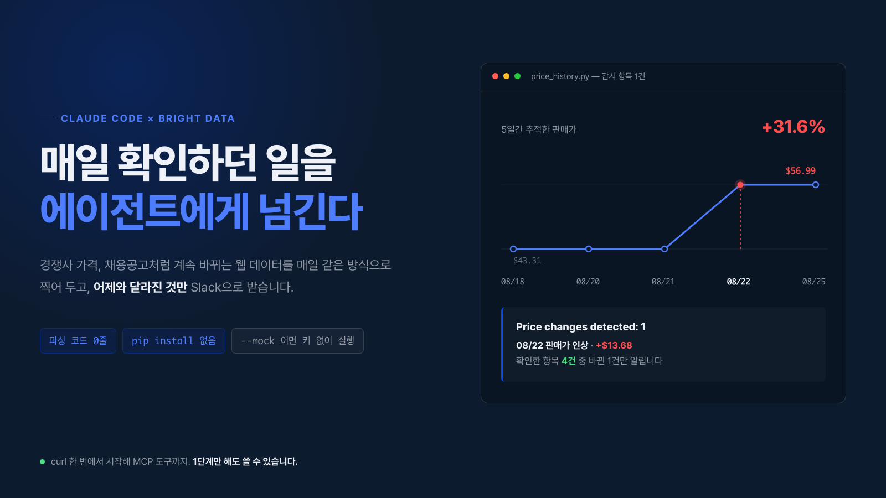
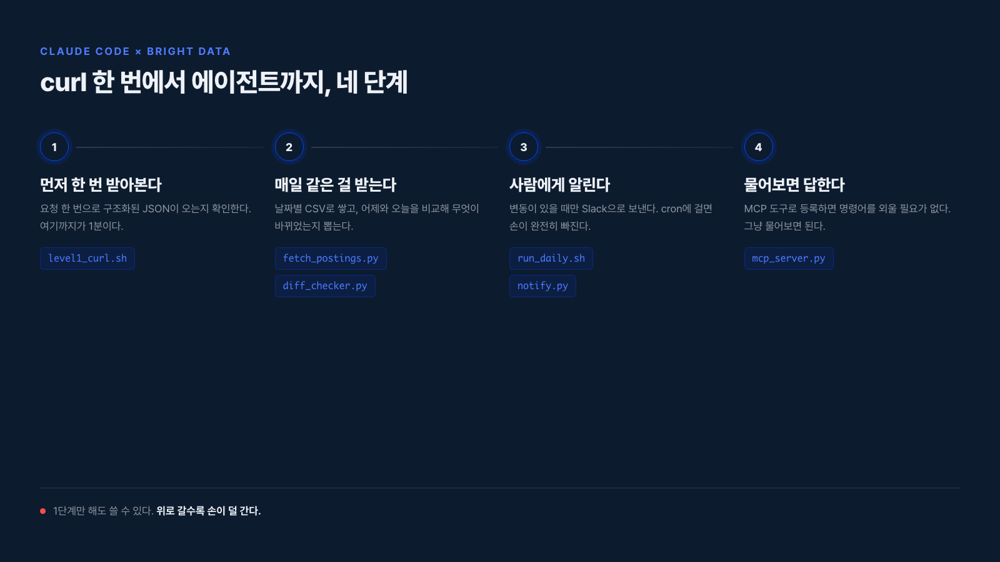
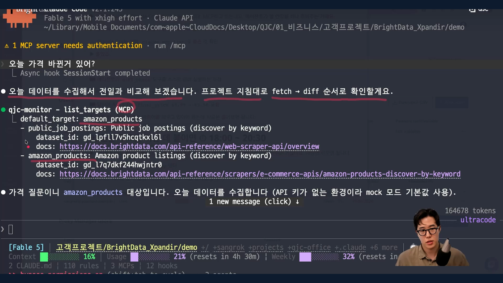
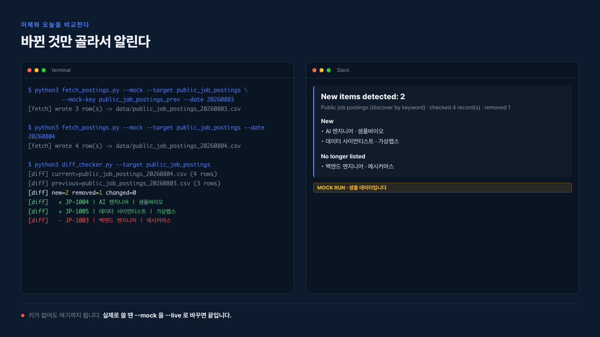

# Claude Code + Bright Data 웹 모니터링 에이전트

경쟁사 가격이나 채용공고처럼 계속 바뀌는 웹 데이터를 매일 자동으로 확인하고, 변화가 생기면 Slack으로 알려주는 에이전트를 Claude Code와 Bright Data로 만드는 실습 레포입니다. QJC 유튜브 8월 Bright Data 협업 영상의 실습 코드이고, 코딩 경험이 많지 않아도 따라 할 수 있게 만들었습니다.

<!-- docs/images/01-hero.png. HTML/CSS 로 렌더한 히어로. 5일간 추적한 판매가 변화(08/22 $43.31 -> $56.99)와 그때 나가는 알림 카드를 한 장에 담았다. 수치는 실제 수집분이다. -->


의존성이 없습니다. Python 3.10 이상만 있으면 `pip install` 없이 그대로 돌아갑니다.

## 무엇을 해결하나

코딩 에이전트는 실무 코드를 잘 짜지만 지금 이 순간 웹에 새로 올라온 내용은 모릅니다. 그래서 보통 크롤러를 직접 짜는데, 사이트 구조가 바뀌고 페이지가 자바스크립트로 렌더링되면서 원래 만들려던 자동화보다 크롤러 유지보수에 시간을 더 쓰게 됩니다.

Bright Data Scraper API는 HTML을 직접 파싱하는 대신 제목, 회사명, 가격, 게시일 같은 필드가 이미 정리된 결과를 돌려줍니다. 스크래퍼 유지보수 부담이 줄고, 워크플로우에 바로 연결할 수 있는 구조화된 결과물을 받게 됩니다.

## 빠른 시작

Python 3.10 이상과 [Bright Data 계정](https://brightdata.com)만 있으면 됩니다. 별도 패키지 설치는 필요 없습니다. 계정을 만들고 API 키를 발급받는 데 몇 분이 걸리고, 그다음 curl 명령 한 번을 실행하는 데는 1분이 채 걸리지 않습니다.

### 키가 있다면: curl로 첫 결과 받기 (1분)

Bright Data 계정 설정에서 API 키를 발급받습니다. [계정 설정 > API keys](https://brightdata.com/cp/setting/users)에서 확인할 수 있습니다.

```bash
export BRIGHTDATA_API_KEY=여기에_발급받은_키
./level1_curl.sh
```

터미널을 껐다 켜면 `export`는 사라집니다. 매번 다시 치기 싫으면 키를 `.env`에 적어 두세요. 스크립트가 알아서 읽습니다.

```bash
cp .env.example .env        # .env 를 열어 BRIGHTDATA_API_KEY=... 한 줄만 채우면 됩니다
./level1_curl.sh
```

curl로 세 번 왕복(요청 시작, 진행 상태 확인, 결과 다운로드)한 뒤, 회사 하나의 공개 기업 정보(업종, 임직원 규모, 홈페이지)가 정리된 JSON이 화면에 뜹니다. 파싱 코드를 한 줄도 안 짰다는 것이 요점입니다. 전체 응답은 `level1_result.json`에 저장됩니다.

### 아직 키가 없다면: mock 모드로 미리 보기

키를 기다리는 동안에도 파이프라인 전체를 미리 볼 수 있습니다. `mock/` 폴더에 들어 있는 합성 샘플 데이터로 똑같은 흐름을 돌립니다.

```bash
python3 fetch_postings.py --mock --target public_job_postings \
        --mock-key public_job_postings_prev --date 20260803    # 어제 기준선
python3 fetch_postings.py --mock --target public_job_postings --date 20260804    # 오늘
python3 diff_checker.py --target public_job_postings             # 신규 2건, 사라짐 1건
python3 notify.py --mock --dry-run                                # Slack 페이로드를 화면에 출력
```

윈도우에서 `python3: command not found`가 뜨면 `python3`를 `python`으로 바꿔 치면 됩니다. python.org 설치본은 `python.exe`만 만들고 `python3.exe`는 안 만들거든요. `.sh` 스크립트들은 두 이름을 알아서 찾으니 그대로 두셔도 됩니다.

`--mock`을 `--live`로 바꾸는 것 외에 코드 변경은 없습니다. 요청 형태가 동일합니다.

```bash
cp .env.example .env        # BRIGHTDATA_API_KEY 입력
set -a && source .env && set +a
python3 fetch_postings.py --live
```

## mock 모드에 관한 고지 (중요)

**`mock/` 폴더의 데이터는 Bright Data 실제 수집 결과가 아닙니다.** API 키가 없어도 파이프라인 전체를 끝까지 실행해 볼 수 있도록 넣어 둔 합성 샘플입니다.

- 필드 이름은 Bright Data 공식 응답 스키마를 그대로 따릅니다
- 값(회사명, 공고 제목, 지원자 수, 가격)은 전부 가상입니다. 실제 회사나 실제 공고가 아닙니다
- 모든 레코드에 `_mock_fixture: true` 표시가 있습니다(다운스트림 CSV 컬럼에는 나타나지 않지만 `mock/` 폴더의 원본 JSON을 열어 보면 확인할 수 있습니다). 실행 로그에는 `MOCK MODE` 배너가, Slack 페이로드에는 `MOCK RUN` 표기가 따로 붙습니다
- 실제 성과 데이터로 인용하면 안 됩니다

## 3단계 구조

| 레벨 | 하는 일 | 파일 |
|---|---|---|
| Level 1 | curl 3번으로 trigger, poll, download | `level1_curl.sh` |
| Level 2 | 파이썬 스크립트로 전체 수집 후 CSV 저장 | `fetch_postings.py`, `bd_client.py` |
| Level 3 | 전일 대비 변화 감지, Slack 알림, cron 스케줄 | `diff_checker.py`, `notify.py`, `run_daily.sh` |
| MCP | Claude Code가 위 스크립트를 도구로 직접 호출 | `mcp_server.py`, `.mcp.json.example` |

<!-- 이미지 자리: docs/images/02-flow.png. Level 1(curl)부터 Level 3(cron+Slack), MCP(Claude Code 연동)까지 4단계가 이어지는 흐름도. 각 단계에서 쓰는 파일명을 함께 표기 -->


## 각 파일이 하는 일

| 파일 | 역할 |
|---|---|
| `bd_client.py` | Bright Data API 클라이언트. trigger, 상태 폴링, 파트 단위 다운로드. LiveTransport와 MockTransport가 같은 인터페이스를 공유합니다 |
| `fetch_postings.py` | 대상 하나를 수집해 `data/<target>_YYYYMMDD.csv`로 저장 |
| `diff_checker.py` | 최근 CSV 2개를 비교해 신규·사라짐·**값 변동**을 JSON으로 산출 |
| `notify.py` | diff JSON을 Slack Block Kit 메시지로 변환. `--dry-run`이면 출력만 |
| `mcp_server.py` | 위 스크립트를 MCP 도구 4종으로 노출하는 stdio 서버 |
| `run_daily.sh` | cron 진입점. 수집, 비교, 알림을 순서대로 실행 |
| `level1_curl.sh` | curl만 쓰는 최소 왕복 예제 |
| `price_history.py` | 이틀 이상 쌓인 CSV로 상품별 가격 변화표를 터미널에 보여주는 보조 스크립트 |
| `scraper_config.json` | 모니터링 대상 정의. `inputs`만 바꾸면 다른 도메인에 그대로 적용됩니다 |
| `CLAUDE.md` | Claude Code 에이전트 지침. 도구 호출 순서와 mock 표기 의무를 규정합니다 |
| `.claude/commands/monitor.md` | `/monitor` 슬래시 커맨드. 수집부터 요약까지 한 번에 실행합니다 |

## Claude Code에 붙이기

두 개의 MCP 서버를 함께 씁니다.

**1. Bright Data 공식 MCP 서버** (검색, 스크래핑 등 60종 이상 도구)

```bash
claude mcp add --transport sse brightdata "https://mcp.brightdata.com/sse?token=<your-api-token>"
claude mcp list
```

**2. 이 레포의 파이프라인 서버** (수집, 비교, 알림)

```bash
cp .mcp.json.example .mcp.json
```

`.mcp.json`은 `${BRIGHTDATA_API_KEY}`를 환경변수에서 읽으므로 키가 파일에 남지 않습니다.

등록 후 Claude Code에서 이렇게 물어보면 에이전트가 스스로 `fetch_postings`, `diff_check`, `notify_slack`을 순서대로 호출합니다.

```
서울 AI 엔지니어 채용공고 오늘 새로 올라온 거 있어?
```

노출되는 도구는 `list_targets`, `fetch_postings`, `diff_check`, `notify_slack` 4종입니다. 도구 호출 순서와 mock 표기 의무는 `CLAUDE.md`에 규정돼 있고, `/monitor` 슬래시 커맨드로도 같은 흐름을 실행할 수 있습니다.

<!-- docs/images/04-mcp.png. 실제 실행 화면 캡처(영상에서 발췌). "오늘 가격 바뀐거 있어?" 한 줄에 list_targets 가 호출되고, 질문 내용을 보고 amazon_products 를 골라 fetch → diff 로 넘어간다. -->


명령어 이름을 외울 필요가 없습니다. "오늘 가격 바뀐거 있어?"라고 물으면 도구 목록을 먼저 확인하고, 질문이 가격에 관한 것이니 `amazon_products`를 고른 뒤 `CLAUDE.md`에 적힌 순서대로 fetch에서 diff로 넘어갑니다. 키가 없는 환경이라 mock 모드가 기본값으로 잡힌 것도 화면에 그대로 나옵니다.

## 매일 자동 실행

```bash
crontab -e
# 매일 오전 9시
0 9 * * * /full/path/to/repo/run_daily.sh --live >> /full/path/to/repo/data/cron.log 2>&1
```

cron은 환경변수가 비어 있는 상태로 시작하므로 `run_daily.sh`가 `.env`를 직접 읽습니다.

## 값이 바뀐 것도 잡기 (`watch_fields`)

신규·삭제만 보면 놓치는 게 있습니다. 어제도 있었고 오늘도 있는 상품은 목록 비교로는 "변화 없음"인데, 그 사이 가격이 절반이 됐을 수 있습니다.

`scraper_config.json`의 타깃에 `watch_fields`를 넣으면 같은 레코드의 그 필드들을 비교해 변동을 따로 보고합니다.

```json
"watch_fields": ["final_price", "is_available", "rating", "reviews_count"]
```

실제로 Amazon 상품을 이틀 연속 수집했을 때 나온 diff 예시입니다(픽스처가 아니라 실데이터입니다).

```
[diff] new=1 removed=0 changed=2
[diff]   ~ B0CDWP1D58 | Redragon K668 108-Key Hot-Swap Wired RGB | final_price 51.99 -> 39.99
```

<!-- 이미지 자리: docs/images/03-diff.png. diff_checker.py 실행 결과 터미널 화면과 그 diff가 Slack 메시지로 도착한 화면을 나란히 배치한 스크린샷 -->


Slack 알림에도 `*Changed*` 섹션으로 `final_price 51.99 → 39.99` 형태로 실립니다. `watch_fields`가 없는 타깃은 종전대로 신규·삭제만 봅니다.

## 다른 도메인에 적용하기

`scraper_config.json`의 `inputs`만 바꾸면 됩니다. 다른 대상을 쓰려면 [Bright Data API 레퍼런스](https://docs.brightdata.com/api-reference/scrapers/management-apis/get-scrapers)에서 해당 스크래퍼의 `dataset_id`를 찾아 `targets`에 항목을 추가하세요. 현재 예시로 두 개가 들어 있습니다.

| 대상 | dataset_id | 문서 |
|---|---|---|
| **Amazon 상품 (키워드 탐색, 기본값)** | `gd_l7q7dkf244hwjntr0` | [링크](https://docs.brightdata.com/api-reference/scrapers/e-commerce-apis/amazon-products-discover-by-keyword) |
| 채용공고 (키워드 탐색) | 직접 입력 | [스크래퍼 목록](https://docs.brightdata.com/api-reference/scrapers/management-apis/get-scrapers) |

Amazon 쪽은 `dataset_id`가 채워져 있어 키만 넣으면 바로 돕니다. 채용공고 쪽은 필드 구성만 예시로 넣어 둔 자리라 `--live`로 쓰려면 어떤 잡보드를 볼지 고르고 그 스크래퍼의 `dataset_id`를 직접 넣어야 합니다. `--mock`은 `dataset_id` 없이도 끝까지 돕니다.

어떤 잡보드를 고르든 그 사이트의 이용약관과 robots.txt를 먼저 확인하세요. 스크래퍼가 있다는 것과 긁어도 된다는 것은 다른 이야기입니다.

예를 들어 자사 쇼핑몰 대신 경쟁사 쇼핑몰의 상품 가격을 감시하고 싶다면, `amazon_products`를 복제해 `inputs`의 검색 키워드만 자기 업종에 맞게 바꾸면 됩니다. 채용공고를 감시하고 싶다면 `public_job_postings`의 `location`, `keyword`를 원하는 직무·지역으로 바꾸면 됩니다.

## 무엇을 봐야 할지 모르겠다면 (`watch_fields` 정하는 법)

새 도메인에 붙일 때 가장 많이 막히는 지점이 "그래서 무엇을 신호로 볼 것인가"입니다. 세 가지 질문으로 좁힙니다.

1. **신규·삭제만으로 충분한가?** 채용공고, 뉴스, 입찰공고처럼 "생겼다/사라졌다"가 곧 의미인 대상은 `watch_fields` 없이 기본값으로 둡니다.
2. **값이 바뀌는 게 더 중요한가?** 가격, 재고, 평점, 모집 인원처럼 "같은 항목인데 숫자가 변했다"가 더 큰 신호라면 `watch_fields`에 그 필드를 추가합니다.
3. **CSV 컬럼에 그 필드가 있는가?** `watch_fields`에 넣는 필드는 반드시 같은 타깃의 `csv_fields`에도 있어야 비교됩니다.

## QJC가 실제로 쓰는 시스템 3개 (usecases/)

이 레포의 기본 파이프라인 위에, QJC가 실제 업무에 쓰는 시스템 세 개를 올렸습니다. 기능 시연이 아니라 진짜 공개 데이터로 돌려서 실제 산출물을 뽑은 기록입니다. 전체 스토리는 [`QJC_USECASES.md`](QJC_USECASES.md)에 있습니다.

| 폴더 | 무엇을 푸나 | 실제 산출물 |
|---|---|---|
| [`usecases/lead-discovery/`](usecases/lead-discovery/) | 손으로 하던 고객 발굴 | 점수 매겨진 리드 210건 |
| [`usecases/competitor-watch/`](usecases/competitor-watch/) | 사이트를 하나씩 열어 보던 가격 조사 | 경쟁 프로그램 59건 비교표 |
| [`usecases/content-radar/`](usecases/content-radar/) | 감으로 정하던 다음 영상 주제 | 영상 342건, 주제 후보 29개 랭킹 |

이 세 시스템은 실행 결과(CSV, 리포트)와 QJC의 실제 고객·채널 데이터를 입력으로 쓰기 때문에, 이 레포에는 코드만 들어 있고 결과 파일과 자격증명은 빠져 있습니다. root의 Level 1~3 파이프라인처럼 그대로 실행해 보는 용도가 아니라, 같은 패턴을 자기 도메인에 어떻게 응용할 수 있는지 보는 참고 사례로 봐 주세요. Bright Data 자격증명 상태는 [`usecases/bd-credential-check.md`](usecases/bd-credential-check.md)에 확인 기록으로 남아 있습니다.

## 사용하는 Bright Data 엔드포인트

전부 `https://api.brightdata.com` 기준이고, 인증은 `Authorization: Bearer <API_KEY>` 헤더입니다.

| 용도 | 엔드포인트 | 문서 |
|---|---|---|
| 수집 시작 (비동기) | `POST /datasets/v3/trigger?dataset_id=...` | [async requests](https://docs.brightdata.com/api-reference/rest-api/scraper/asynchronous-requests) |
| 진행 상태 확인 | `GET /datasets/v3/progress/{snapshot_id}` | [monitor progress](https://docs.brightdata.com/api-reference/scrapers/management-apis/monitor-progress) |
| 결과 다운로드 | `GET /datasets/v3/snapshot/{snapshot_id}?format=json` | [download snapshot](https://docs.brightdata.com/api-reference/scrapers/delivery-apis/download-snapshot) |
| 파트 개수 확인 | `GET /datasets/v3/snapshot/{snapshot_id}/parts` | [delivery parts](https://docs.brightdata.com/api-reference/scrapers/management-apis/get-snapshot-delivery-parts) |
| 동기 수집 (1분 제한) | `POST /datasets/v3/scrape?dataset_id=...` | [sync requests](https://docs.brightdata.com/api-reference/scrapers/synchronous-requests) |
| 인증 | Bearer 토큰 | [authentication](https://docs.brightdata.com/api-reference/authentication) |

알아두면 좋은 제약입니다. 결과는 16일간 보관되고, 요청당 다운로드 상한은 5GB이며, `batch_size`의 최소값은 1000입니다.

## 자주 만나는 에러

| 에러 메시지 | 뜻 | 해결 |
|---|---|---|
| `BRIGHTDATA_API_KEY is not set` | `--live`로 실행했는데 키를 아직 환경변수에 넣지 않았습니다 | `.env.example`을 `.env`로 복사하고 키를 채운 뒤 `source .env`, 또는 지금은 `--mock`으로 먼저 확인 |
| `401 Unauthorized` | 키가 틀렸거나 만료됐습니다 | [계정 설정 > API keys](https://brightdata.com/cp/setting/users)에서 키를 다시 확인하거나 새로 발급 |
| `HTTP 402/403 ... 크레딧` 관련 문구 | 계정 크레딧이 부족하거나 이 데이터셋에 접근 권한이 없습니다 | [결제 페이지](https://brightdata.com/cp/billing)에서 잔액과 요금제를 확인 |
| `No mock fixtures for '...'` | `mock/` 폴더에 그 타깃용 픽스처 파일이 없습니다 | `mock/<mock_key>_part1.json` 형식으로 직접 만들거나, `--live`로 전환 |
| `SLACK_WEBHOOK_URL is not set` | Slack 알림을 실제로 보내려는데 웹훅 URL이 없습니다 | `.env`에 웹훅 URL을 넣거나, 확인만 하려면 `--dry-run` 사용 |

## 시크릿 관리

- 자격증명은 환경변수 `BRIGHTDATA_API_KEY`, `SLACK_WEBHOOK_URL`로만 읽습니다
- `.env`와 `.mcp.json`은 `.gitignore`에 있습니다. 커밋되는 것은 `.env.example`뿐입니다
- 코드, 설정, 로그 어디에도 키를 적지 않습니다

## 필요한 것 / 필요 없는 것

- Python 3.10 이상. `pip install`이 필요한 패키지가 없습니다(표준 라이브러리만 사용). 그래서 `requirements.txt`가 따로 없습니다. 3.11·3.12·3.13·3.14에서 실행을 확인했습니다
- robots.txt 판정기는 `usecases/_shared/robots.py`에 직접 구현했습니다. 표준 라이브러리 `urllib.robotparser`는 CPython 3.14에서야 RFC 9309로 재작성돼, 그 이전 버전에서는 `*`·`$`·최장 일치를 무시하고 **막아야 할 경로를 허용해 버립니다**. 대부분의 환경이 그 구간이라 위임하지 않았습니다
- Bright Data 계정과 API 키 (Level 1을 실제로 돌리거나 `--live`로 전환할 때만 필요, mock 모드는 키 없이 동작)
- (선택) Slack Incoming Webhook. 알림을 실제로 받고 싶을 때만 필요합니다. 없어도 `--dry-run`으로 페이로드를 확인할 수 있습니다

## 라이선스와 이용

이 레포 자체는 [MIT 라이선스](LICENSE)입니다. 공개적으로 접근 가능한 웹 데이터를 대상으로 하며, 각 사이트의 이용약관과 관련 법령을 확인한 뒤 사용하시기 바랍니다.
